<h1 align="center">venvyard</h1>

<p align="center">
  <strong>Every Python virtual environment on your machine, in one place.</strong><br>
  Create, find, inspect, copy, rename, repair and clean them up, with one command.
</p>

<p align="center">
  
  
  
  
  <a href="https://github.com/a-khavish/venvyard/actions/workflows/tests.yml"></a>
</p>

<p align="center">
  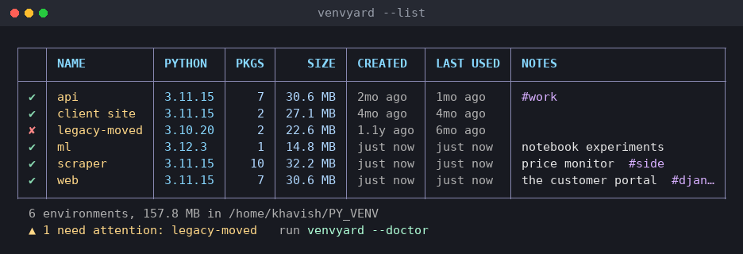
</p>

---

## Why

Virtual environments accumulate. One per project, one per tutorial, one you made
to test something in 2023. They are scattered across your disk, you cannot
remember which has what in it, they quietly eat gigabytes, and renaming a folder
silently breaks one because a venv has its own absolute path written inside it.

`venvyard` keeps them all in a single folder, the *yard* (`~/PY_VENV` by
default), and gives you one command to manage the lot.

Because every environment is a direct child of one folder, the registry **is**
the directory listing. There is no index to fall out of sync with reality.

---

## Install

```bash
git clone https://github.com/a-khavish/venvyard.git
cd venvyard
./install.sh
```

Open a new terminal (or `source ~/.bashrc`) and you are done.

<details>
<summary>Would rather download than clone?</summary>
<br>

Take the latest [release](https://github.com/a-khavish/venvyard/releases), or
use **Code > Download ZIP**. Either way GitHub wraps everything in a folder
named after what you downloaded, and drops the leading `v` from a tag. So the
v1.0.0 release unpacks into `venvyard-1.0.0`, and the main branch unpacks into
`venvyard-main`. Neither is plain `venvyard`:

```bash
unzip venvyard-1.0.0.zip     # or venvyard-main.zip
cd venvyard-1.0.0            # or venvyard-main
./install.sh
```

If that reports `Permission denied`, the unzip tool dropped the executable bit, so run
`bash install.sh` instead.
</details>

<p align="center">
  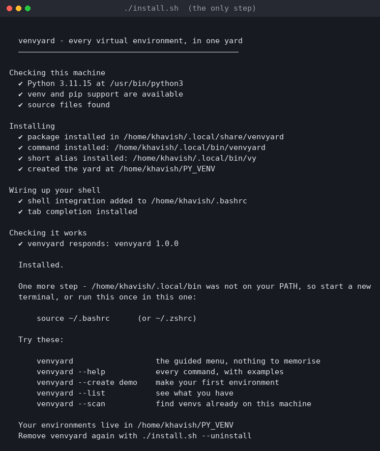
</p>

The installer checks your Python, installs the package, creates the `venvyard`
and `vy` commands, makes the yard, installs tab completion, and adds the shell
function that `--activate` needs. It touches nothing else, and re-running it is
safe.

| Flag | What it does |
|---|---|
| `./install.sh` | install for the current user (`~/.local`) |
| `./install.sh --system` | install for everyone (`/usr/local`, uses sudo) |
| `./install.sh --prefix DIR` | install to a specific location |
| `./install.sh --no-shell` | do not touch shell startup files |
| `./install.sh --quiet` | install with minimal output (`-q` also works) |
| `./install.sh --uninstall` | remove it again (your environments are left alone) |

**Requirements:** Linux, Python 3.8+, and the `venv` module. There are no
third-party dependencies; it is all standard library.

**No Python at all?** venvyard is written in Python, so it cannot conjure
Python out of nothing, but the installer is plain shell and handles the
situation properly. It detects your distribution and offers to run the right
command:

<p align="center">
  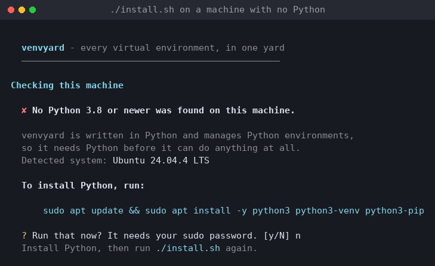
</p>

It knows apt, dnf, pacman, zypper, apk, xbps and emerge, and falls back to
detecting whichever package manager is on your PATH. Answer `n` and it simply
prints the command for you to run yourself. The same applies when Python is
present but the `venv` module is missing, a common gap on Debian and Ubuntu.

---

## The thirty-second tour

```bash
venvyard --create web              # make one
venvyard --list                    # see everything
venvyard -a web                    # activate it in this shell
venvyard --install web requests    # install into it
venvyard -x web pytest -q          # run something in it without activating
venvyard --copy web=web-backup     # duplicate before something risky
venvyard --scan                    # find venvs already scattered on this machine
venvyard --prune --days 60         # clean up what you stopped using
venvyard                           # ...or just run it and use the menu
```

---

## What it looks like

<details open>
<summary><strong>Activating actually works</strong></summary>
<br>

No program can change the environment of the shell that launched it. That is
how processes work, not a limitation of this tool. Every tool that activates
environments ships a shell function, and the installer sets ours up for you.

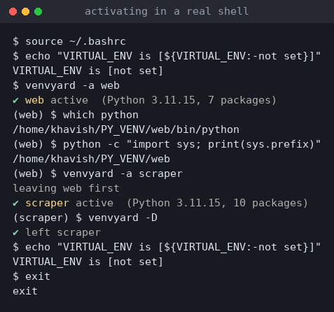

Switching to a second environment leaves the first automatically. If the
integration is not loaded, `venvyard -a NAME` tells you exactly what to do, and
`venvyard --shell NAME` works regardless.
</details>

<details>
<summary><strong>Everything about one environment</strong></summary>
<br>
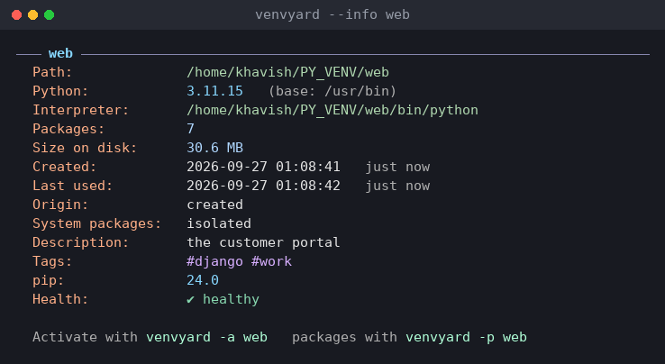
</details>

<details>
<summary><strong>The whole yard at a glance</strong></summary>
<br>
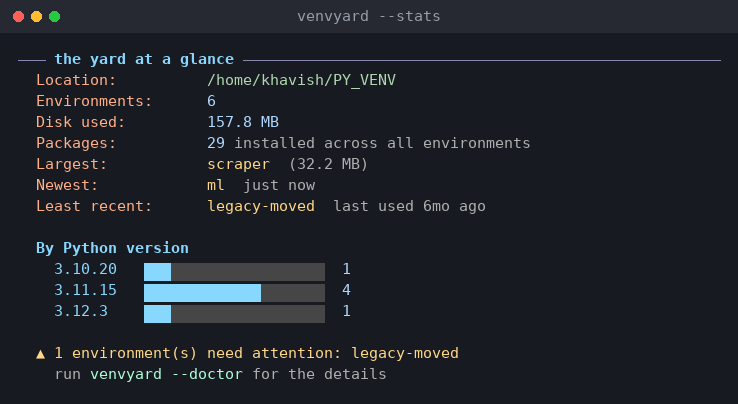
</details>

<details>
<summary><strong>Which Pythons do you actually have?</strong></summary>
<br>

`--pythons` probes every interpreter on your PATH: its version, whether it can
create environments at all, its pip version, and how many of your environments
were built with it. It also names the versions you *do not* have, and gives the
exact command to install them on your distribution.

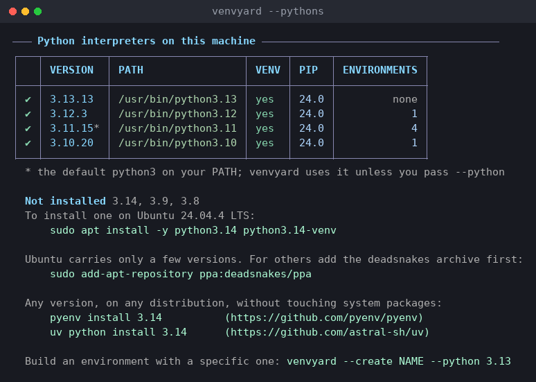
</details>

<details>
<summary><strong>What is installed in there</strong></summary>
<br>
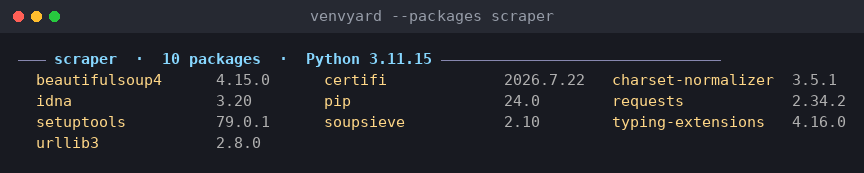
</details>

<details>
<summary><strong>Finding what is eating your disk</strong></summary>
<br>
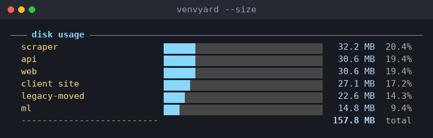

And clearing out what you stopped using. Nothing is deleted without
confirmation, and `--dry-run` shows you the damage first:

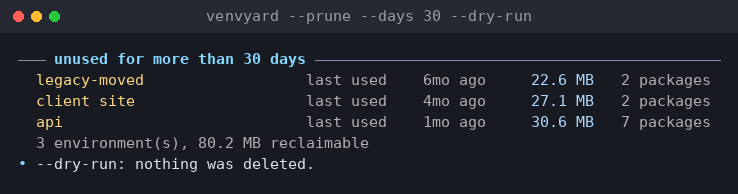
</details>

<details>
<summary><strong>Which environment has that package?</strong></summary>
<br>
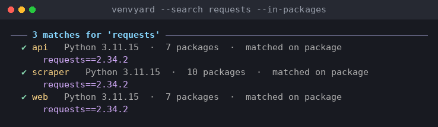
</details>

<details>
<summary><strong>Catching the breakage a system upgrade causes</strong></summary>
<br>

When your distribution upgrades Python, every environment built against the old
version silently stops seeing its own packages. This is the most common way a
venv dies, and it is not something path rewriting can fix, so `venvyard` says
so and points at the rebuild instead of pretending.

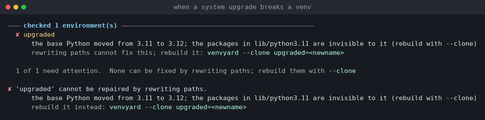
</details>

<details>
<summary><strong>Repairing an environment someone moved by hand</strong></summary>
<br>
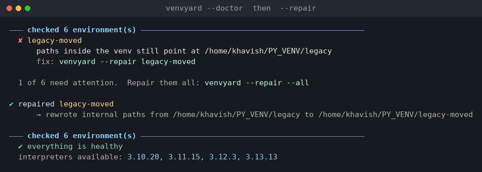
</details>

<details>
<summary><strong>The guided menu, if you would rather not remember flags</strong></summary>
<br>
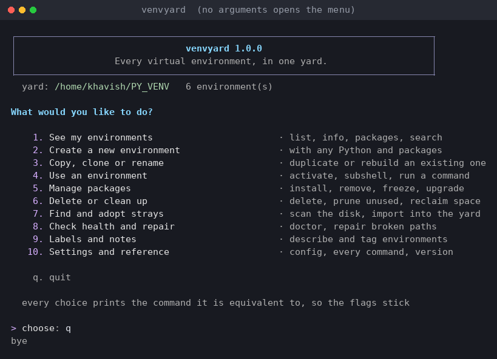

Every choice prints the command line it is equivalent to, so the flags stick
without you having to study them. Creating an environment walks you through
four steps:

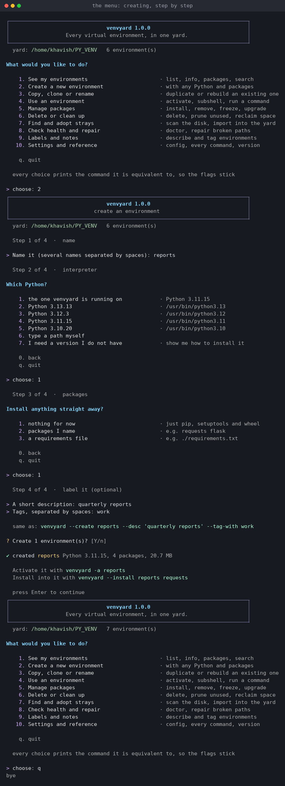
</details>

<details>
<summary><strong>Adopting environments from elsewhere on disk</strong></summary>
<br>
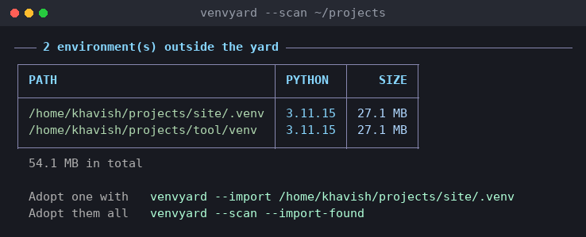
</details>

---

## Every command

`venvyard --help` gives the full reference with examples;
`venvyard --help COMMAND` gives one command's own page.

<details>
<summary><strong>See the full <code>--help</code> screen</strong></summary>
<br>
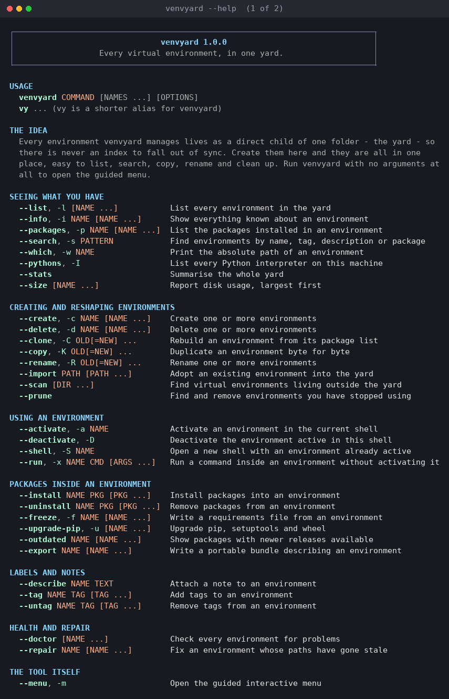
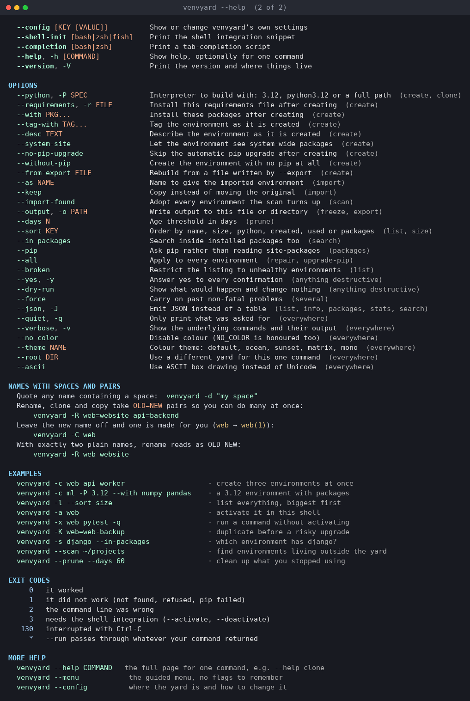

Each command also has a page of its own, with every option that applies to it:

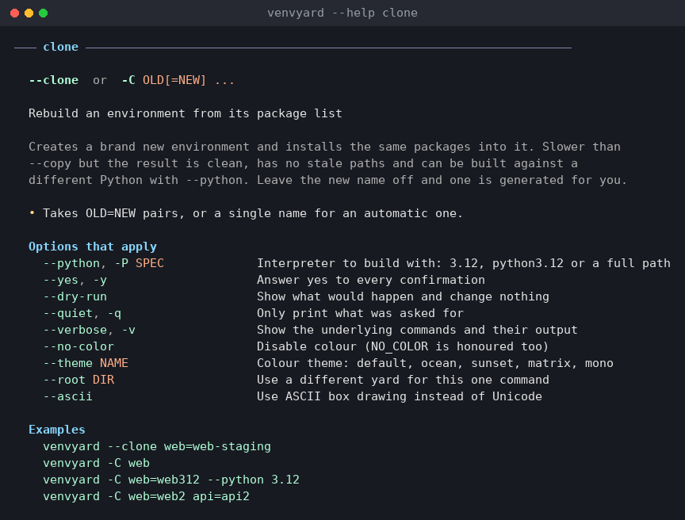
</details>

### Seeing what you have

| Command | Short | What it does |
|---|---|---|
| `--list [NAME ...]` | `-l` | Every environment: Python, packages, size, age, health |
| `--info NAME ...` | `-i` | The full record for an environment |
| `--packages NAME ...` | `-p` | What is installed, with versions |
| `--search PATTERN` | `-s` | By name, tag, description, or `--in-packages` |
| `--which NAME` | `-w` | Just the path, for scripts and IDE settings |
| `--pythons` | `-I` | Every Python interpreter on this machine (alias `--interpreters`) |
| `--stats` | | The whole yard at a glance |
| `--size [NAME ...]` | | Disk usage, ranked, with a total |

### Creating and reshaping

| Command | Short | What it does |
|---|---|---|
| `--create NAME ...` | `-c` | Create one or several |
| `--delete NAME ...` | `-d` | Delete one or several (asks first) |
| `--clone OLD[=NEW] ...` | `-C` | Rebuild clean from the package list |
| `--copy OLD[=NEW] ...` | `-K` | Duplicate byte for byte, paths rewritten |
| `--rename OLD[=NEW] ...` | `-R` | Rename and fix the paths inside |
| `--import PATH ...` | | Adopt an environment from elsewhere |
| `--scan [DIR ...]` | | Find environments living outside the yard |
| `--prune` | | Find and remove what you stopped using |

### Using an environment

| Command | Short | What it does |
|---|---|---|
| `--activate NAME` | `-a` | Activate in the current shell |
| `--deactivate` | `-D` | Leave the active one |
| `--shell NAME` | `-S` | A subshell with it already active |
| `--run NAME CMD ...` | `-x` | Run a command in it without activating (alias `--exec`) |

### Packages

| Command | Short | What it does |
|---|---|---|
| `--install NAME PKG ...` | | pip install, inside that environment |
| `--uninstall NAME PKG ...` | | pip uninstall |
| `--freeze NAME ...` | `-f` | Write a requirements file |
| `--upgrade-pip [NAME ...]` | `-u` | Upgrade pip, setuptools and wheel |
| `--outdated NAME ...` | | What has a newer release on PyPI |
| `--export NAME ...` | | A portable bundle you can rebuild from |

### Labels, health and the tool itself

| Command | Short | What it does |
|---|---|---|
| `--describe NAME TEXT` | | Attach a note |
| `--tag` / `--untag NAME TAG ...` | | Free-form labels you can search on |
| `--doctor [NAME ...]` | | Check everything for problems |
| `--repair NAME ...` | | Fix stale paths (use after moving one by hand) |
| `--menu` | `-m` | The guided interactive menu |
| `--config [KEY [VALUE]]` | | Show or change settings |
| `--shell-init [SHELL]` | | Print the shell integration snippet for bash, zsh or fish |
| `--completion [SHELL]` | | Print a tab-completion script for bash, zsh or fish |
| `--help [COMMAND]` | `-h` | Help, optionally for one command |
| `--version` | `-V` | Version and where things live |

### Options

`--python/-P SPEC`, `--requirements/-r FILE`, `--with PKG...`, `--tag-with TAG...`,
`--desc TEXT`, `--system-site`, `--no-pip-upgrade`, `--without-pip`,
`--from-export FILE`, `--as NAME`, `--keep`, `--import-found`, `--output/-o PATH`,
`--days N`, `--sort KEY`, `--in-packages`, `--pip`, `--all`, `--broken`,
`--yes/-y`, `--dry-run`, `--force`, `--json/-J`, `--quiet/-q`, `--verbose/-v`,
`--no-color`, `--theme NAME`, `--root DIR`, `--ascii`.

---

## Things worth knowing

### Names with spaces, and doing several at once

Quote anything with a space. Every command takes several names:

```bash
venvyard -c web api worker
venvyard -d old scratch "my space" --yes
```

Rename, clone and copy take `OLD=NEW` pairs, so you can do many in one go:

```bash
venvyard -R web=website api=backend
venvyard -R web website        # with exactly two names, it reads as OLD NEW
venvyard -C web                # no new name: one is generated, web(1)
```

### `--copy` versus `--clone`

Both duplicate an environment; they differ in how.

- **`--copy`** copies the directory byte for byte, then rewrites every absolute
  path baked into it. Fast, exact, keeps editable installs, and keeps any
  existing mess.
- **`--clone`** builds a new environment and installs the same packages into it.
  Slower, but the result is clean and can target a *different* Python:
  `venvyard -C web=web312 --python 3.12`.

### Renaming actually works

A virtual environment has its own absolute path written into `pyvenv.cfg`, into
`bin/activate`, and into the shebang of every console script pip installed. That
is why moving one with `mv` breaks it, and why `pip` inside a renamed venv
suddenly reports "bad interpreter".

`--rename`, `--copy`, `--import` and `--repair` all rewrite those paths, so a
renamed environment, and the command-line tools installed inside it, keep
working. If you move one by hand, `--doctor` spots it and `--repair` fixes it.

### Asking for a Python you do not have

`--python 3.14` will never quietly hand you 3.11 instead. If the version you
asked for is not installed, venvyard refuses, tells you what you *do* have, and
prints the command to install what you asked for:

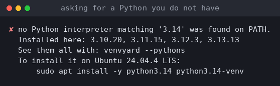

### It will not let you shoot yourself in the foot

- Nothing outside the yard can ever be deleted.
- Deleting an environment that is active in your current shell is refused unless
  you pass `--force`; renaming one warns you afterwards.
- Everything destructive asks first, and `--dry-run` shows you exactly what
  would happen.
- A creation interrupted with Ctrl-C cleans up after itself rather than leaving
  a half-built environment behind.

### Output for scripts

`--json` gives machine-readable output for `--list`, `--info`, `--packages`,
`--search`, `--stats`, `--size`, `--scan`, `--doctor`, `--outdated`,
`--pythons` and `--version`. `--which` prints a bare path and nothing else:

```bash
cd "$(venvyard -w web)"
code --python "$(venvyard -w web --python)"

# every unhealthy environment, for a cron job or a CI check
venvyard --doctor --json | jq -r '.unhealthy | keys[]'

# adopt everything a scan turns up, reviewing it first
venvyard --scan --json | jq -r '.[].path'
```

Exit codes: `0` success, `1` failure, `2` bad command line, `3` needs the shell
integration, `130` interrupted. `--run` passes through whatever your command
returned.

### Settings

```bash
venvyard --config                       # show everything and where it lives
venvyard --config root ~/envs           # keep the yard somewhere else
venvyard --config theme ocean           # default, ocean, sunset, matrix, mono
venvyard --config autoname_style dash   # web-1 instead of web(1)
```

| Key | Default | What it does |
|---|---|---|
| `root` | `~/PY_VENV` | Where the yard lives |
| `theme` | `default` | `default`, `ocean`, `sunset`, `matrix`, `mono` |
| `color` | `true` | Colour output at all |
| `autoname_style` | `paren` | `paren` gives `web(1)`, `dash` gives `web-1` |
| `confirm_destructive` | `true` | Ask before anything destructive |
| `default_python` | *(empty)* | Interpreter for new environments; empty means the one running venvyard |
| `with_pip_upgrade` | `true` | Upgrade pip right after creating |
| `list_show_size` | `true` | Include the size column in `--list` |
| `scan_roots` | `["~"]` | Where `--scan` looks by default |
| `scan_skip` | *(see `--config`)* | Directories `--scan` walks past |
| `prune_days` | `90` | Default age for `--prune` |

Per-command overrides: `--root DIR`, `--theme NAME`.

| Environment variable | Effect |
|---|---|
| `VENVYARD_HOME` | Use a different yard |
| `VENVYARD_THEME` | Use a different theme |
| `NO_COLOR` | Disable colour (honoured as standard) |
| `VENVYARD_FORCE_COLOR` | Keep colour even when output is piped |
| `VENVYARD_ASCII` | ASCII box drawing instead of Unicode |
| `VENVYARD_NO_CLEAR` | Stop the menu clearing the screen |

---

## Coming from somewhere else

Already have environments scattered across your projects? Bring them in:

```bash
venvyard --scan ~/projects              # see what is out there
venvyard --import ~/projects/site/.venv # adopt one
venvyard --scan --import-found          # adopt everything it finds
```

Importing moves the environment into the yard and repairs its paths, so it works
from its new home. Pass `--keep` to copy instead of move.

---

## Tests

```bash
pip install pytest
pytest                      # everything
pytest -m "not slow"        # skip the tests that build real environments
```

The suite covers the parts where a mistake is silent rather than loud: name
validation and automatic naming, `OLD=NEW` operand splitting (where an existing
environment has to win over the pair shape), absolute-path rewriting on rename
and repair, registry consistency, and the shell integration and completion
output for bash, zsh and fish, each checked for its own syntax and, when that
shell is installed, parsed by it.

Every test runs against a throwaway yard in a temporary directory. Nothing in
the suite can touch a real `~/PY_VENV`.

---

## Uninstalling

```bash
./install.sh --uninstall
```

Your environments in `PY_VENV` are left exactly where they are. Delete them
yourself if you want them gone.

---

## Licence

**Copyright © 2026 Khavish Auckaloo. All rights reserved.**

This is proprietary software, published here for reference and evaluation only.
You may read the source. You may **not** copy, modify, distribute or use it, in
whole or in part, without prior written permission from the owner. Only the
owner may modify this software.

See [LICENSE](LICENSE) for the full terms. For permission requests, please
[open an issue](https://github.com/a-khavish/venvyard/issues).
